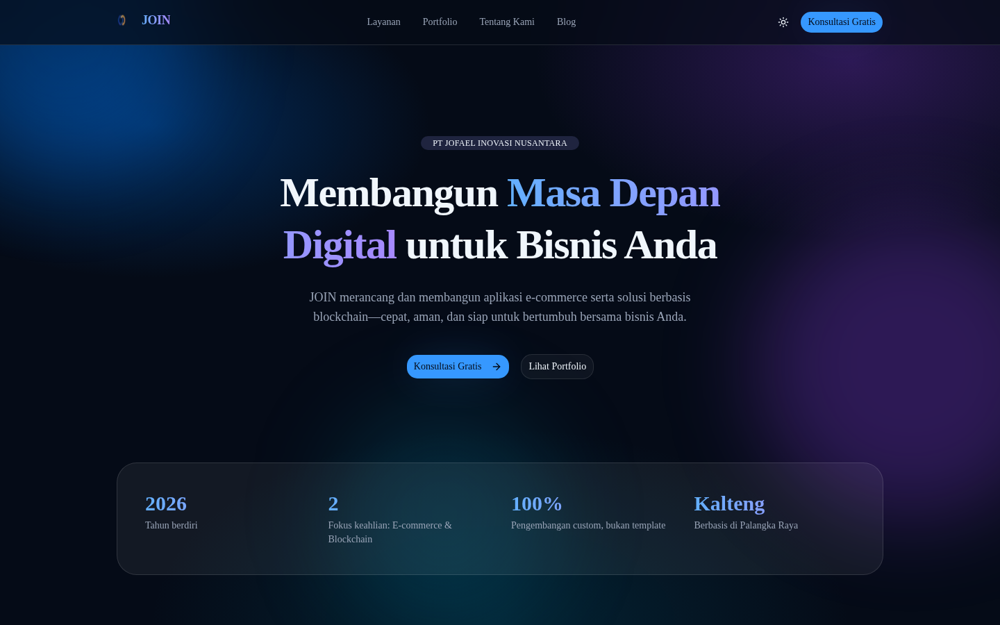
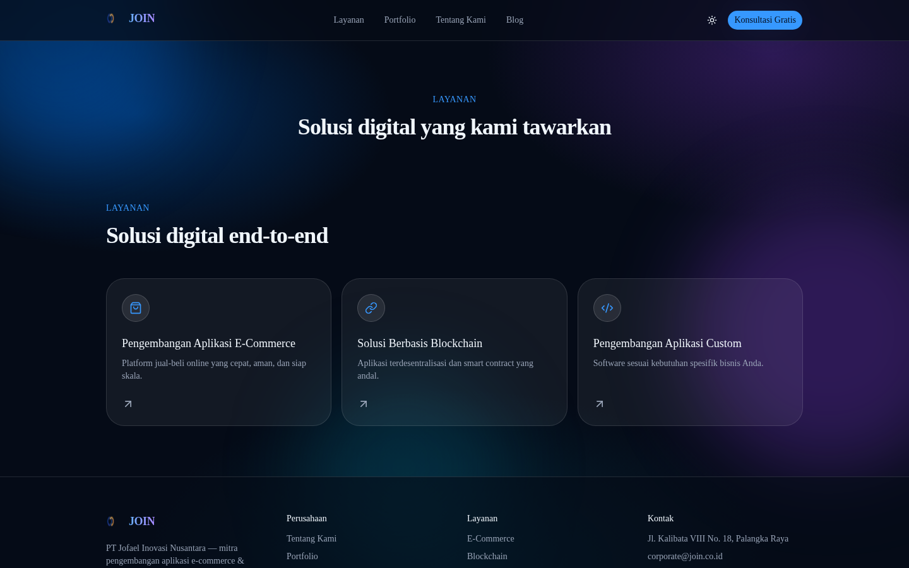
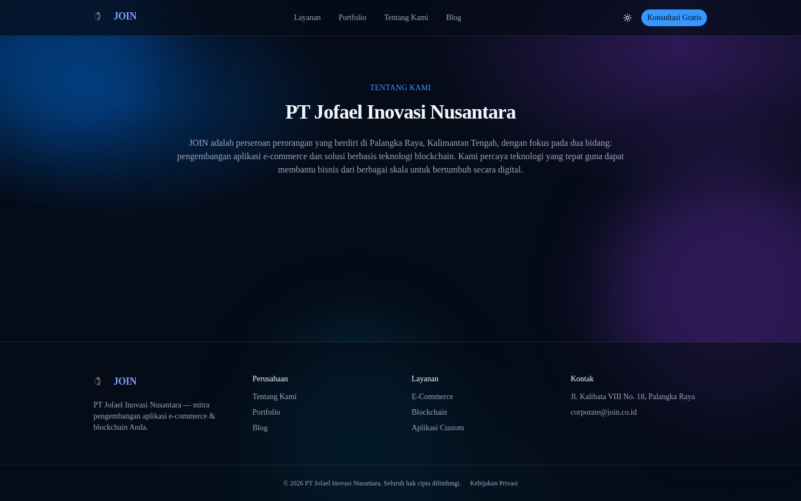
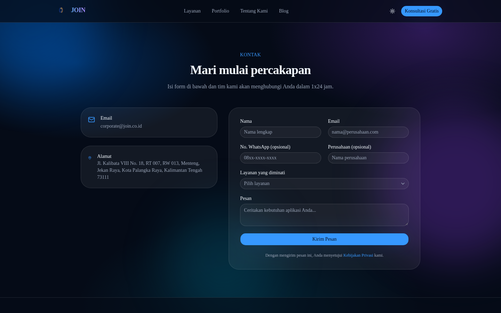

# JOIN — join.co.id

Website perusahaan PT Jofael Inovasi Nusantara (JOIN). Lihat `docs/adr/`
untuk keputusan arsitektur.

## Tampilan

| Beranda | Layanan |
|---|---|
|  |  |

| Tentang Kami | Kontak |
|---|---|
|  |  |

## Stack

- **Frontend**: Next.js 16 (App Router) + Tailwind CSS v4 + shadcn/ui (Base UI) + Framer Motion + React Hook Form + Zod
- **Backend**: FastAPI (async SQLAlchemy 2.0 + Alembic) + PostgreSQL
- **Infra**: Docker Compose + Caddy (reverse proxy) + Cloudflare Tunnel (live di join.co.id, www.join.co.id, api.join.co.id)

## Struktur repo

```
apps/web/     Next.js — situs publik
apps/api/     FastAPI — konten + form kontak + admin
infra/        Caddyfile, backup.sh
docs/adr/     catatan keputusan arsitektur
docker-compose.yml
.env.example
```

## Menjalankan secara lokal/produksi (Docker Compose)

```bash
cp .env.example .env   # isi semua nilai, generate SECRET_KEY dengan: openssl rand -hex 32
docker compose build
docker compose up -d db api web caddy

# migrasi + seed data awal (services, admin user)
docker compose exec api alembic upgrade head
docker compose exec api python seed.py
```

Cek:
- `curl -H "Host: join.co.id" http://127.0.0.1:8080/` → situs
- `curl -H "Host: api.join.co.id" http://127.0.0.1:8080/api/services` → JSON layanan
- `http://<vps>:8000/docs` (lewat SSH tunnel) → Swagger UI FastAPI, jangan expose publik

Login admin: `POST /api/auth/token` dengan `username`/`password` sesuai
`SEED_ADMIN_EMAIL` / `SEED_ADMIN_PASSWORD` di `.env`, lalu pakai
`Authorization: Bearer <token>` untuk endpoint `/api/admin/*`.

## Admin dashboard (Next.js)

`https://join.co.id/admin` — login pakai kredensial `SEED_ADMIN_EMAIL` /
`SEED_ADMIN_PASSWORD`. Fitur saat ini:
- **Ringkasan** — jumlah leads & layanan
- **Leads** — daftar pesan dari form kontak, tandai selesai
- **Tentang Kami** — edit judul/teks halaman /tentang + CRUD anggota tim
- **Layanan / Portfolio / Blog / Testimoni** — CRUD penuh (tambah/edit/hapus/publish-draft) untuk masing-masing

Arsitektur auth: login menyimpan JWT dari FastAPI ke cookie httpOnly
(`join_admin_token`, domain join.co.id). Server Component memanggil FastAPI
langsung pakai cookie itu; komponen client (form, tombol aksi) lewat proxy
route `/api/admin/proxy/*` di Next.js yang menempelkan header
`Authorization` di sisi server — token JWT tidak pernah terekspos ke
JavaScript browser. `proxy.ts` melakukan redirect optimis ke
`/admin/login` bila cookie tidak ada.

## Notifikasi email lead baru

Kosongkan `SMTP_HOST` di `.env` (default) untuk menonaktifkan — form
kontak tetap berfungsi normal. Untuk mengaktifkan, isi `SMTP_HOST`,
`SMTP_PORT`, `SMTP_USER`, `SMTP_PASSWORD` di `.env` (lihat komentar di
`.env.example` untuk contoh pakai Google Workspace), lalu:

```bash
docker compose up -d api
```

Setiap submission form kontak baru akan mengirim email ke
`NOTIFY_EMAIL_TO` (default `corporate@join.co.id`) lewat background task
— kegagalan kirim email tidak pernah menggagalkan penyimpanan lead itu
sendiri, cukup tercatat di `docker compose logs api`.

## Tombol WhatsApp mengambang

Kosongkan `NEXT_PUBLIC_WHATSAPP_NUMBER` di `.env` (default) untuk
menyembunyikan tombolnya. Isi dengan nomor + kode negara tanpa "+"/spasi
(mis. `6281234567890`), lalu **rebuild** `web` (variabel ini di-inline
saat build, bukan runtime):

```bash
docker compose build web && docker compose up -d web
```

Kalau memakai CI (`build-and-push.yml`), set repository variable
`WHATSAPP_NUMBER` di GitHub (Settings → Secrets and variables → Actions
→ Variables) supaya image hasil build otomatis juga menyertakannya.

## Menyambungkan ke domain join.co.id (Cloudflare Tunnel)

Sudah aktif untuk `join.co.id`, `www.join.co.id`, dan `api.join.co.id`.
Untuk setup ulang atau pindah VPS:

1. Di dashboard Cloudflare → **Zero Trust** → **Networks** → **Tunnels & Mesh**, buat/pilih tunnel.
2. Di halaman detail tunnel, tambah **Published application route** untuk tiap hostname (`join.co.id`, `www.join.co.id`, `api.join.co.id`), semuanya dengan **Service Type: HTTP** (bukan HTTPS) mengarah ke `caddy:80`. DNS record dibuat otomatis oleh Cloudflare.
3. Salin token tunnel ke `.env` sebagai `CLOUDFLARE_TUNNEL_TOKEN`.
4. Jalankan: `docker compose --profile prod up -d cloudflared`

Catatan: kode sisi-server Next.js (Server Component, Route Handler)
memanggil FastAPI lewat `INTERNAL_API_URL=http://api:8000` (jaringan
internal Docker), **bukan** lewat `api.join.co.id` — supaya situs tetap
berfungsi walau Tunnel/DNS publik sedang bermasalah. Hanya kode di
browser (form kontak) yang memanggil `NEXT_PUBLIC_API_URL` (domain publik).

## Migrasi database

```bash
# setelah mengubah model di apps/api/app/models/
docker compose exec api alembic revision --autogenerate -m "deskripsi perubahan"
docker compose cp api:/app/alembic/versions/. apps/api/alembic/versions/   # salin file migrasi ke host, lalu commit
docker compose exec api alembic upgrade head
```

## Backup database

`infra/backup.sh` men-dump PostgreSQL ke `backups/*.sql.gz` (retensi 14
hari). Sudah dijadwalkan lewat cron setiap jam 02:00. **Disarankan**
menyinkronkan folder `backups/` ke penyimpanan off-site (mis. `rclone`)
agar aman jika VPS ini bermasalah.

Restore:
```bash
gunzip -c backups/join-db-<timestamp>.sql.gz | docker compose exec -T db psql -U join join
```

## Pindah ke VPS lain

Karena semua state hidup di volume `db_data` dan definisi infra ada
sebagai kode, pindah VPS = clone repo + restore backup terbaru + arahkan
Cloudflare Tunnel ke VPS baru (tidak perlu ganti DNS). Detail di
`docs/adr/002-deployment-topology.md`.

## Build otomatis ke GHCR (untuk VPS RAM kecil)

`.github/workflows/build-and-push.yml` build image `web`/`api` dan
push ke `ghcr.io/lordvaster/join-corp-{web,api}` setiap push ke `main`.
Ini memungkinkan deploy ke VPS spek kecil tanpa perlu build di sana —
lihat `docs/low-memory-vps.md` untuk panduan lengkap (termasuk setup
swap dan batas memori per container).

## Yang masih perlu dikerjakan

- Isi `SMTP_HOST`/dst di `.env` supaya notifikasi email lead aktif (lihat bagian di atas)
- Isi `NEXT_PUBLIC_WHATSAPP_NUMBER` supaya tombol WhatsApp muncul (lihat bagian di atas)
- Sinkronisasi backup ke penyimpanan off-site
